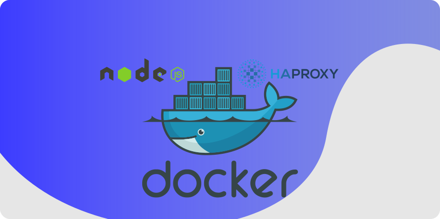

<h1 align="center">
    
</h1>

<h4 align="center"> 
	🚧 PlayGround 🚀 mod dev... 🚧
</h4>


## 🚀 Executando o projeto


💡Para executar em modo SSL é necessário a geração de certificados validados. Neste caso, foi ultilizado uma VPS e um Dominio [Hostinger][hostinger].


### Pré-requisitos

Antes de começar, você vai precisar ter instalado em sua máquina as seguintes ferramentas:
[Git](https://git-scm.com), [Docker][docker] e o plugin [docker-compose][docker-compose]. 


### 🎲 Clonando o repositório e gerando os certificados

```bash
# Clone este repositório
$ git clone https://github.com/Almir2017/node-docker-haproxy.git

# Acesse a pasta do projeto haproxy
$ cd node-docker-haproxy/haproxy

# instale letsencrypt
$ sudo apt install letsencrypt

# Gere os cerfificados
$ certbot certonly --standalone

# Após gerar os certificados concatene os arquivos.pem
$ cat /etc/letsencrypt/live/seu-dominio/fullchain.pem /etc/letsencrypt/live/seu-dominio/privkey.pem | tee node-docker-haproxy/haproxy/haproxy.pem

```

### 🧭 Building e Dockerize o projeto.

```bash
# Acesse o diretório /node-docker-haproxy
$  docker build -t nodeapp .

# Execute o seguinte comando para subir os containers
$ docker-compose up -d

# Execute este comando para encerrar os containers
$ docker-compose down


# A aplicação será aberta no dominio inserido durante a geração dos certificados
```

[vscode]: https://code.visualstudio.com/
[docker]: https://docs.docker.com/engine/install
[docker-compose]: https://docs.docker.com/compose/install
[hostinger]: https://hostinger.com.br?REFERRALCODE=1ALLMIR59